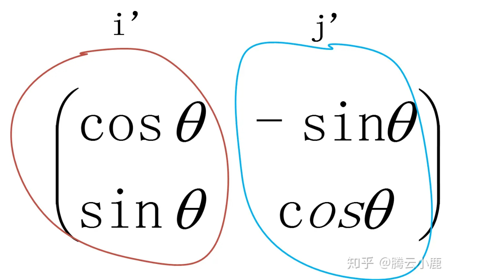

# 极坐标推导
$$x=rcos(a)$$
$$y=rsin(a)$$
$$x'=rcos(a+\theta)=rcosacos\theta-rsinasin\theta = xcos\theta-ysin\theta$$
$$y'=rcos(a+\theta)=rcosasin\theta+rsinacos\theta=xsin\theta+ycos\theta$$

# 直角坐标推导

老坐标系的基矢
$$i=\left(\begin{matrix}cos0\\sin0\end{matrix}\right)$$
$$j=\left(\begin{matrix}cos\frac{\pi}{2}\\sin\frac{\pi}{2}\end{matrix}\right)$$
而后将坐标轴旋转$$\theta$$可得
$$i'=\left(\begin{matrix}cos\theta\\sin\theta\end{matrix}\right)$$
$$j=\left(\begin{matrix}cos(\frac{\pi}{2}+\theta)\\sin(\frac{\pi}{2}+\theta)\end{matrix}\right)=\left(\begin{matrix}-sin\theta\\cos\theta\end{matrix}\right)$$
新坐标系相对于老坐标系的旋转可以表示位(i', j')
即

# 基矢和旋转矩阵的关系
基矢(basis vectors)和旋转矩阵之间存在着密切的关系。基矢描述了坐标系统的方向,而旋转矩阵则描述了一个向量在不同坐标系统之间是如何旋转的。

我们以二维平面为例,假设有一个笛卡尔坐标系统(x, y),其基矢为 $\hat{\mathbf{i}}$ 和 $\hat{\mathbf{j}}$。现在,我们对坐标系统进行逆时针旋转 $\theta$ 角度,得到一个新的坐标系统 $(x', y')$,其基矢为 $\hat{\mathbf{i}}'$ 和 $\hat{\mathbf{j}}'$。

新的基矢 $\hat{\mathbf{i}}'$ 和 $\hat{\mathbf{j}}'$ 可以由原来的基矢 $\hat{\mathbf{i}}$ 和 $\hat{\mathbf{j}}$ 通过旋转矩阵 $\mathbf{R}(\theta)$ 进行线性组合得到:

$$
\begin{pmatrix}
\hat{\mathbf{i}}' \
\hat{\mathbf{j}}'
\end{pmatrix}
= \mathbf{R}(\theta)
\begin{pmatrix}
\hat{\mathbf{i}} \
\hat{\mathbf{j}}
\end{pmatrix}
$$

其中旋转矩阵 $\mathbf{R}(\theta)$ 为:

$$
\mathbf{R}(\theta) =
\begin{pmatrix}
\cos\theta & -\sin\theta \
\sin\theta & \cos\theta
\end{pmatrix}
$$

代入后可得:

$$
\begin{pmatrix}
\hat{\mathbf{i}}' \
\hat{\mathbf{j}}'
\end{pmatrix}
= \begin{pmatrix}
\cos\theta & -\sin\theta \
\sin\theta & \cos\theta
\end{pmatrix}
\begin{pmatrix}
1 \ 0
\end{pmatrix}
= \begin{pmatrix}
\cos\theta \ \sin\theta
\end{pmatrix}
$$

$$
\begin{pmatrix}
\hat{\mathbf{i}}' \
\hat{\mathbf{j}}'
\end{pmatrix}
= \begin{pmatrix}
\cos\theta & -\sin\theta \
\sin\theta & \cos\theta
\end{pmatrix}
\begin{pmatrix}
0 \ 1
\end{pmatrix}
= \begin{pmatrix}
-\sin\theta \ \cos\theta
\end{pmatrix}
$$

因此,新的基矢 $\hat{\mathbf{i}}'$ 和 $\hat{\mathbf{j}}'$ 分别是原基矢通过旋转矩阵 $\mathbf{R}(\theta)$ 进行线性组合得到的。

这种关系可以推广到三维空间,其中三维旋转矩阵可以通过欧拉角或者旋转矢量来构造。任何一个向量在新旧坐标系统之间的变换,都可以通过基矢和旋转矩阵的乘积来实现。

# 基矢为什么是列向量
在线性代数中,基矢(basis vectors)通常被表示为矩阵的列向量,而不是行向量。原因如下:

基矢的线性组合表示向量
任何一个向量都可以通过基矢的线性组合来表示。例如,在二维空间中,一个向量 $\vec{v}$ 可以表示为:

$$\vec{v} = x\hat{\mathbf{i}} + y\hat{\mathbf{j}}$$

其中 $\hat{\mathbf{i}}$ 和 $\hat{\mathbf{j}}$ 是基矢,而 $x$ 和 $y$ 是相应的系数。

矩阵-向量乘法的几何意义
当我们将一个矩阵 $\mathbf{A}$ 与一个列向量 $\vec{x}$ 相乘时,得到的结果 $\mathbf{A}\vec{x}$ 是另一个列向量。

$$\mathbf{A}\vec{x} = \begin{bmatrix}
a_{11} & a_{12} & \cdots & a_{1n} \
a_{21} & a_{22} & \cdots & a_{2n} \
\vdots & \vdots & \ddots & \vdots \
a_{m1} & a_{m2} & \cdots & a_{mn}
\end{bmatrix} \begin{bmatrix}
x_1 \ x_2 \ \vdots \ x_n
\end{bmatrix} = \begin{bmatrix}
a_{11}x_1 + a_{12}x_2 + \cdots + a_{1n}x_n \
a_{21}x_1 + a_{22}x_2 + \cdots + a_{2n}x_n \
\vdots \
a_{m1}x_1 + a_{m2}x_2 + \cdots + a_{mn}x_n
\end{bmatrix}$$

这种矩阵-向量乘法具有线性变换的几何意义,即将一个向量 $\vec{x}$ 通过矩阵 $\mathbf{A}$ 进行线性变换,得到另一个向量。

基矢作为矩阵的列向量
由于基矢是用于表示任意向量的"基本单位",因此我们可以将它们组合成一个矩阵,其中每一列对应一个基矢。例如,在二维平面中,基矢 $\hat{\mathbf{i}}$ 和 $\hat{\mathbf{j}}$ 可以表示为:

$$\begin{bmatrix}
1 & 0 \
0 & 1
\end{bmatrix}$$

通过这种方式,任何一个向量 $\vec{v} = x\hat{\mathbf{i}} + y\hat{\mathbf{j}}$ 都可以用矩阵-向量乘法来表示:

$$\begin{bmatrix}
1 & 0 \
0 & 1
\end{bmatrix} \begin{bmatrix}
x \ y
\end{bmatrix} = \begin{bmatrix}
x \ y
\end{bmatrix} = \vec{v}$$

因此,将基矢作为矩阵的列向量不仅符合线性代数的表示习惯,而且也与矩阵-向量乘法的几何意义相吻合。
